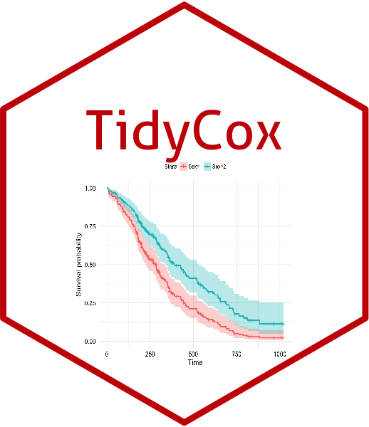

<!-- README.md is generated from README.Rmd. Please edit that file -->

# TidyCox: Make building cox models easier in R 

[](https://lifecycle.r-lib.org/articles/stages.html)
[](https://cran.r-project.org/web/packages/devtools/index.html)
[](https://hits.seeyoufarm.com)
[](https://github.com/lizhiwei1994/tidycox/issues)

## :bar_chart: Overview

The
[tidymodel](https://cran.r-project.org/web/packages/tidymodels/index.html)
and
[survival](https://cran.r-project.org/web/packages/survival/index.html)
packages are good enough to do most of the work of fitting cox models
and extracting model results.
[TidyCox](https://github.com/lizhiwei1994/tidycox) package provides some
tiny functions to make fitting cox models and extracting model results
more easy.

## :arrow_double_down: Installation

You can install the development version of **tidycox** from Github with:

``` r
devtools::install_github('lizhiwei1994/tidycox')
```

## :beginner: Usage

There are 3 functions in tidycox, `cox.time()`, `cox.formula()` and
`cox.result()`. Next I will introduce the usage of these 3 functions one
by one.

## `cox.time()`

`cox.time()` can calculate the survival time for each patient in **long
data format**. It has two parameters `date` and `outcome`, which
represent the follow-up date, and the outcome at the time of follow-up,
respectively.

First we create a data frame `df` in long data format containing three
variables: `id`, `date` and `outcome.` `id` is the unique patient
identification code. `date` is the date of the follow-up visit.
`outcome` is the outcome at the time of the follow-up visit, where `1`
and `0` represent the occurrence and non-occurrence of the event of
interest, respectively.

``` r
library(dplyr)
df = data.frame(
  id = c(1,1,1,1, 2,2,2,2, 3,3,3,3, 4,4,4,4),
  date = c('2013-01-01', '2014-01-01', '2015-01-01', '2016-01-01',
           '2013-01-01', '2014-01-01', '2015-01-01', '2016-01-01',
           '2013-01-01', '2014-01-01', '2015-01-01', '2016-01-01',
           '2013-01-01', '2014-01-01', '2015-01-01', '2016-01-01'),
  outcome = c(0,0,1,1, 0,1,0,0, 1,1,0,0, 0,0,0,0)
) %>% 
  mutate(date = as.Date(date)) %>% 
  group_by(id) %>% 
  mutate(follow_up = row_number()) %>% 
  ungroup() %>% 
  as_tibble()
df
#> # A tibble: 16 × 4
#>       id date       outcome follow_up
#>    <dbl> <date>       <dbl>     <int>
#>  1     1 2013-01-01       0         1
#>  2     1 2014-01-01       0         2
#>  3     1 2015-01-01       1         3
#>  4     1 2016-01-01       1         4
#>  5     2 2013-01-01       0         1
#>  6     2 2014-01-01       1         2
#>  7     2 2015-01-01       0         3
#>  8     2 2016-01-01       0         4
#>  9     3 2013-01-01       1         1
#> 10     3 2014-01-01       1         2
#> 11     3 2015-01-01       0         3
#> 12     3 2016-01-01       0         4
#> 13     4 2013-01-01       0         1
#> 14     4 2014-01-01       0         2
#> 15     4 2015-01-01       0         3
#> 16     4 2016-01-01       0         4
```

Since we are using a long data format, we need to use the `group_by()`
function in the `dplyr` package to group the `id`s and also combine it
with the `mutate()` function to calculate the survival time `time`. The
survival time of the same `id` is the same.

``` r
# devtools::install_github('lizhiwei1994/tidycox')
library(tidycox)

df %>% group_by(id) %>% 
  mutate(time = cox.time(date = date, outcome = outcome))
#> # A tibble: 16 × 5
#> # Groups:   id [4]
#>       id date       outcome follow_up time     
#>    <dbl> <date>       <dbl>     <int> <drtn>   
#>  1     1 2013-01-01       0         1  730 days
#>  2     1 2014-01-01       0         2  730 days
#>  3     1 2015-01-01       1         3  730 days
#>  4     1 2016-01-01       1         4  730 days
#>  5     2 2013-01-01       0         1  365 days
#>  6     2 2014-01-01       1         2  365 days
#>  7     2 2015-01-01       0         3  365 days
#>  8     2 2016-01-01       0         4  365 days
#>  9     3 2013-01-01       1         1    0 days
#> 10     3 2014-01-01       1         2    0 days
#> 11     3 2015-01-01       0         3    0 days
#> 12     3 2016-01-01       0         4    0 days
#> 13     4 2013-01-01       0         1 1095 days
#> 14     4 2014-01-01       0         2 1095 days
#> 15     4 2015-01-01       0         3 1095 days
#> 16     4 2016-01-01       0         4 1095 days
```

The parameter date in cox.time can also accept numeric variables

``` r
df %>% group_by(id) %>% 
  mutate(time = cox.time(date = follow_up, outcome = outcome))
#> # A tibble: 16 × 5
#> # Groups:   id [4]
#>       id date       outcome follow_up  time
#>    <dbl> <date>       <dbl>     <int> <int>
#>  1     1 2013-01-01       0         1     2
#>  2     1 2014-01-01       0         2     2
#>  3     1 2015-01-01       1         3     2
#>  4     1 2016-01-01       1         4     2
#>  5     2 2013-01-01       0         1     1
#>  6     2 2014-01-01       1         2     1
#>  7     2 2015-01-01       0         3     1
#>  8     2 2016-01-01       0         4     1
#>  9     3 2013-01-01       1         1     0
#> 10     3 2014-01-01       1         2     0
#> 11     3 2015-01-01       0         3     0
#> 12     3 2016-01-01       0         4     0
#> 13     4 2013-01-01       0         1     3
#> 14     4 2014-01-01       0         2     3
#> 15     4 2015-01-01       0         3     3
#> 16     4 2016-01-01       0         4     3
```
